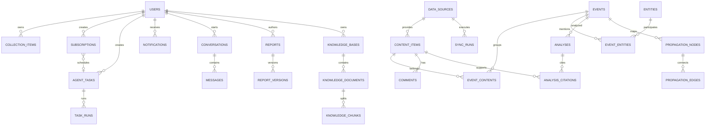

# InfoPulse 数据库设计

版本：1.0  
数据库：PostgreSQL 16；开发环境可使用 SQLite，但全文搜索、向量和部分索引能力以 PostgreSQL 为准。

## 1. 约定

- 主键使用 UUID，字段类型记为 `uuid`。
- 时间统一保存 UTC `timestamptz`，前端按用户时区显示。
- 表名使用复数蛇形命名。
- 业务枚举保存为短字符串，并在应用层与数据库约束双重校验。
- 所有外键明确 `ON DELETE` 行为。
- 重要对象使用 `deleted_at` 软删除；原始内容按保留策略清理。
- 灵活的外部原始响应可使用 `jsonb`，核心查询字段必须独立成列。

## 2. ER 图

## 3. 身份与设置

### 3.1 `users`

| 字段 | 类型 | 约束/说明 |
| --- | --- | --- |
| id | uuid | PK |
| username | varchar(50) | UNIQUE, NOT NULL |
| email | varchar(254) | UNIQUE, NOT NULL，存储小写 |
| password_hash | varchar(255) | NOT NULL |
| avatar_url | varchar(1000) | NULL |
| locale | varchar(16) | 默认 `zh-CN` |
| timezone | varchar(64) | 默认 `Asia/Shanghai` |
| theme | varchar(16) | `system/light/dark` |
| status | varchar(20) | `pending/active/suspended/deleted` |
| email_verified_at | timestamptz | NULL |
| last_login_at | timestamptz | NULL |
| created_at | timestamptz | NOT NULL |
| updated_at | timestamptz | NOT NULL |
| deleted_at | timestamptz | NULL |

索引：`lower(email)` 唯一索引、`lower(username)` 唯一索引、`status`。

### 3.2 `auth_identities`

`id uuid PK`、`user_id uuid FK users CASCADE`、`provider varchar(30)`、`provider_user_id varchar(255)`、`provider_email varchar(254)`、`created_at`。唯一约束 `(provider, provider_user_id)`。

### 3.3 `refresh_tokens`

`id uuid PK`、`user_id`、`token_hash varchar(255)`、`device_name varchar(120)`、`ip_address inet`、`user_agent text`、`expires_at`、`revoked_at`、`created_at`。只保存哈希。

### 3.4 `user_preferences`

`user_id uuid PK/FK`、`workspace_layout jsonb`、`default_industries jsonb`、`notification_preferences jsonb`、`privacy_preferences jsonb`、`updated_at`。

### 3.5 `model_providers`

`id`、`owner_id nullable`、`provider`、`name`、`base_url`、`encrypted_api_key`、`is_system`、`enabled`、`last_test_status`、`last_test_at`、`created_at`、`updated_at`。密钥使用应用级 KMS/主密钥加密。

### 3.6 `model_profiles`

`id`、`owner_id`、`name`、`purpose`、`provider_id`、`model_name`、`temperature`、`max_tokens`、`fallback_profile_id`、`enabled`、`created_at`、`updated_at`。

## 4. 数据源与采集

### 4.1 `data_sources`

| 字段 | 类型 | 说明 |
| --- | --- | --- |
| id | uuid | PK |
| key | varchar(60) | UNIQUE，如 `hacker_news` |
| name | varchar(120) | 展示名 |
| source_type | varchar(30) | `official_api/rss/web/unofficial_api` |
| base_url | varchar(1000) | 来源主页 |
| config | jsonb | 非敏感配置 |
| encrypted_credentials | text | 可空，加密凭证 |
| enabled | boolean | 默认 true |
| health_status | varchar(20) | `unknown/healthy/degraded/down` |
| sync_interval_minutes | int | >= 5 |
| last_sync_at | timestamptz | NULL |
| last_success_at | timestamptz | NULL |
| last_error | text | NULL |
| created_at/updated_at | timestamptz | |

### 4.2 `sync_runs`

`id`、`source_id`、`trigger_type(manual/schedule/retry)`、`status(queued/running/succeeded/partial/failed/cancelled)`、`started_at`、`finished_at`、`fetched_count`、`created_count`、`updated_count`、`skipped_count`、`error_count`、`cursor jsonb`、`error_summary text`、`diagnostic_id`。

索引：`(source_id, started_at desc)`、`status`。

### 4.3 `content_items`

| 字段 | 类型 | 说明 |
| --- | --- | --- |
| id | uuid | PK |
| source_id | uuid | FK data_sources RESTRICT |
| external_id | varchar(500) | 来源对象 ID |
| canonical_url | varchar(2000) | 原文地址 |
| title | text | NOT NULL |
| body | text | 可空 |
| author_name | varchar(300) | 可空 |
| author_external_id | varchar(500) | 可空 |
| content_type | varchar(30) | `news/post/video/paper/release/issue/forum` |
| language | varchar(16) | BCP 47 |
| region | varchar(80) | 可空 |
| published_at | timestamptz | 可空 |
| fetched_at | timestamptz | NOT NULL |
| view_count/comment_count/like_count/share_count | bigint | 可空，真实字段 |
| is_official | boolean | 默认 false |
| is_original | boolean | 可空 |
| content_hash | char(64) | SHA-256 |
| raw_payload | jsonb | 原始响应 |
| search_vector | tsvector | PostgreSQL 全文搜索 |
| deleted_at | timestamptz | NULL |

唯一约束：`(source_id, external_id)`；当 external_id 缺失时使用 `content_hash` 去重。索引：`published_at desc`、`content_type`、`language`、GIN `search_vector`、`content_hash`。

### 4.4 `comments`

`id`、`content_item_id`、`source_id`、`external_id`、`parent_id nullable`、`author_name`、`body`、`like_count`、`published_at`、`fetched_at`、`sentiment_label`、`emotion_label`、`content_hash`、`raw_payload`。唯一 `(source_id, external_id)`，索引 `(content_item_id, like_count desc)`。

## 5. 事件与知识分析

### 5.1 `events`

`id`、`title varchar(500)`、`slug varchar(600) UNIQUE`、`summary text`、`category varchar(80)`、`status(detected/developing/responded/cooling/closed)`、`heat_score numeric(8,2)`、`risk_score numeric(5,2)`、`confidence numeric(5,2)`、`started_at`、`ended_at`、`last_activity_at`、`created_by nullable`、`created_at`、`updated_at`、`deleted_at`。

索引：`(status, heat_score desc)`、`risk_score desc`、`last_activity_at desc`。

### 5.2 `event_contents`

`event_id FK CASCADE`、`content_item_id FK CASCADE`、`relevance_score numeric(5,2)`、`is_primary boolean`、`added_by(user/system)`、`created_at`。复合主键 `(event_id, content_item_id)`。

### 5.3 `entities`

`id`、`name`、`normalized_name`、`entity_type(person/company/organization/product/project/location/industry/policy)`、`description`、`metadata jsonb`、`created_at`、`updated_at`。唯一 `(entity_type, normalized_name)`。

### 5.4 `entity_aliases`

`id`、`entity_id`、`alias`、`normalized_alias`、`language`。唯一 `(entity_id, normalized_alias)`，GIN/普通索引用于查找。

### 5.5 `event_entities`

`event_id`、`entity_id`、`role`、`mention_count`、`confidence`、`created_at`。复合主键 `(event_id, entity_id, role)`。

### 5.6 `analyses`

`id`、`event_id nullable`、`user_id nullable`、`analysis_type`、`status`、`result jsonb`、`summary text`、`confidence`、`model_profile_id`、`prompt_version`、`data_from`、`data_to`、`generated_at`、`error_message`。

### 5.7 `analysis_citations`

`id`、`analysis_id`、`content_item_id nullable`、`comment_id nullable`、`knowledge_chunk_id nullable`、`quote text`、`locator jsonb`、`claim_index int`。约束至少一个引用目标非空。

### 5.8 `propagation_nodes`

`id`、`event_id`、`content_item_id nullable`、`platform`、`node_type(first_source/media/kol/official/repost)`、`occurred_at`、`influence_score`、`is_verified`、`created_at`。

### 5.9 `propagation_edges`

`id`、`event_id`、`from_node_id`、`to_node_id`、`relation_type(repost/reference/similar/inferred)`、`confidence`、`evidence jsonb`、`created_at`。唯一 `(from_node_id, to_node_id, relation_type)`。

## 6. 用户工作与自动化

### 6.1 `collection_folders`

`id`、`user_id`、`name`、`parent_id nullable`、`sort_order`、`created_at`、`updated_at`。

### 6.2 `collection_items`

`id`、`user_id`、`folder_id nullable`、`target_type(event/content/entity/keyword/report/search)`、`target_id nullable`、`target_key nullable`、`note`、`tags jsonb`、`created_at`。唯一 `(user_id, target_type, target_id)`；关键词使用 `target_key`。

### 6.3 `subscriptions`

`id`、`user_id`、`name`、`target_type`、`target_id nullable`、`query jsonb`、`schedule`、`timezone`、`channels jsonb`、`enabled`、`last_run_at`、`next_run_at`、`created_at`、`updated_at`、`deleted_at`。

### 6.4 `agent_tasks`

`id`、`user_id`、`subscription_id nullable`、`name`、`task_type`、`schedule nullable`、`timezone`、`input_config jsonb`、`output_config jsonb`、`model_profile_id nullable`、`approval_policy`、`enabled`、`last_run_at`、`next_run_at`、`created_at`、`updated_at`、`deleted_at`。

### 6.5 `task_runs`

`id`、`task_id`、`status(queued/running/waiting_approval/succeeded/partial/failed/cancelled)`、`trigger_type`、`started_at`、`finished_at`、`progress`、`result jsonb`、`error_message`、`diagnostic_id`、`prompt_tokens`、`completion_tokens`、`cost_amount numeric(12,6)`、`created_at`。

### 6.6 `notifications`

`id`、`user_id`、`notification_type`、`title`、`body`、`severity(info/success/warning/critical)`、`target_type`、`target_id`、`group_key`、`is_read`、`read_at`、`archived_at`、`created_at`。索引 `(user_id, is_read, created_at desc)` 和 `group_key`。

### 6.7 `recent_views`

`id`、`user_id`、`target_type`、`target_id`、`viewed_at`。唯一 `(user_id, target_type, target_id)`，重复访问更新 `viewed_at`。

### 6.8 `recommendations`

`id`、`user_id`、`event_id nullable`、`content_item_id nullable`、`score`、`importance`、`reason`、`impact`、`suggested_action`、`citations jsonb`、`generated_at`、`expires_at`、`dismissed_at`。

### 6.9 `recommendation_feedback`

`id`、`recommendation_id`、`user_id`、`feedback_type(useful/not_useful/not_interested/seen/low_quality)`、`comment`、`created_at`。唯一 `(recommendation_id, user_id)`。

## 7. AI 会话与报告

### 7.1 `conversations`

`id`、`user_id`、`title`、`event_id nullable`、`context_config jsonb`、`model_profile_id nullable`、`created_at`、`updated_at`、`deleted_at`。

### 7.2 `messages`

`id`、`conversation_id`、`role(system/user/assistant/tool)`、`content text`、`status(streaming/completed/failed)`、`tool_name`、`tool_payload jsonb`、`model_name`、`prompt_tokens`、`completion_tokens`、`created_at`。

### 7.3 `message_citations`

与 `analysis_citations` 结构相同，关联 `message_id`。

### 7.4 `reports`

`id`、`user_id`、`title`、`report_type`、`status(draft/generating/ready/failed/archived)`、`source_config jsonb`、`current_version_id nullable`、`created_at`、`updated_at`、`deleted_at`。

### 7.5 `report_versions`

`id`、`report_id`、`version_number`、`content_markdown text`、`structured_content jsonb`、`citations jsonb`、`created_by`、`created_at`。唯一 `(report_id, version_number)`。

### 7.6 `report_exports`

`id`、`report_id`、`version_id`、`format(docx/pdf/markdown/html)`、`status`、`storage_key`、`file_size`、`expires_at`、`created_at`。

## 8. 知识库

### 8.1 `knowledge_bases`

`id`、`owner_id`、`name`、`description`、`visibility(private/team)`、`embedding_model`、`chunk_config jsonb`、`created_at`、`updated_at`、`deleted_at`。

### 8.2 `knowledge_documents`

`id`、`knowledge_base_id`、`filename`、`mime_type`、`source_type(upload/url)`、`source_url`、`storage_key`、`file_size`、`content_hash`、`status(uploaded/parsing/indexing/ready/failed)`、`version`、`page_count`、`error_message`、`created_at`、`updated_at`、`deleted_at`。唯一 `(knowledge_base_id, content_hash, version)`。

### 8.3 `knowledge_chunks`

`id`、`document_id`、`chunk_index`、`content`、`token_count`、`locator jsonb`、`embedding vector(N)`、`created_at`。唯一 `(document_id, chunk_index)`；向量使用 pgvector HNSW/IVFFlat 索引。

## 9. 审计与文件

### 9.1 `audit_logs`

`id`、`actor_id nullable`、`action`、`target_type`、`target_id`、`changes jsonb`、`ip_address`、`created_at`。只追加，不允许业务更新。

### 9.2 `stored_files`

`id`、`owner_id`、`purpose`、`storage_key`、`original_name`、`mime_type`、`size`、`sha256`、`scan_status`、`created_at`、`deleted_at`。

## 10. 数据完整性

- 删除用户：先进入冷静期，随后删除/匿名化个人数据；共享报告按团队策略处理。
- 删除数据源：存在内容时禁止物理删除，只允许停用。
- 删除内容：事件关联和引用保留墓碑记录，避免引用静默错位。
- 所有分数范围 0-100，数据库 CHECK 约束。
- `published_at` 不得晚于当前时间过多；异常时间保存原始值并标记。
- 任何 AI 引用必须指向存在且用户可访问的对象。

## 11. 迁移策略

1. 保留现有 `users`，添加字段并迁移状态。
2. 创建数据源、内容、事件和引用表。
3. 将可追溯的 `analysis_histories` 转为 `analyses`；无法可靠转换的记录保留只读归档。
4. 新功能仅写入新模型，停止扩展 `analysis_histories.output_result`。
5. 完成双读验证后下线旧工作流表。

## 12. 备份与保留

- PostgreSQL 每日全量、持续 WAL，按部署等级确定 RPO/RTO。
- 原始响应默认保留 90 天；聚合字段和引用按报告/事件保留策略保存。
- 同步日志默认 30 天，审计日志至少 180 天。
- 任务运行和通知默认 90 天，可由用户设置延长。
- 知识库原文件与向量在用户删除后进入延迟清理队列。
