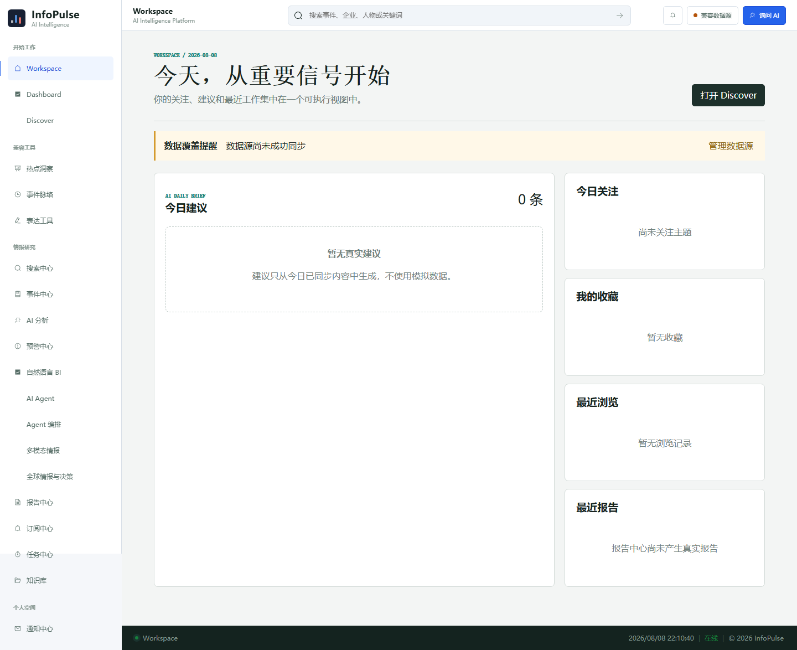
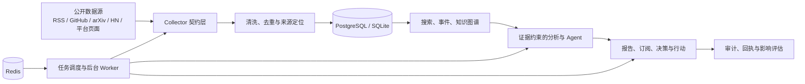
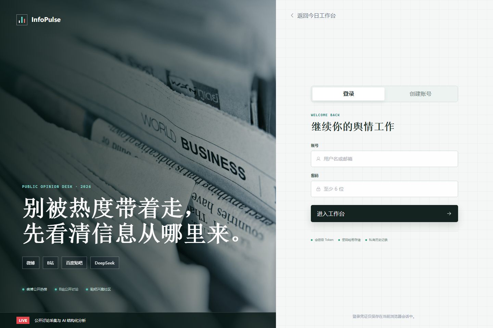

# 从舆情工作台到可验证智能平台：InfoPulse 的开源工程设计

> 本文基于 InfoPulse 2026-08-08 的代码与实测结果，介绍项目背景、架构选择、关键实现、验证方法、问题解决过程、已知不足与后续路线。它不是营销材料，也不把未配置的第三方服务描述为已经完成真实生产验证。



## 1. 背景：信息很多，可信结论很少

公开讨论分散在社交平台、技术社区、新闻源和研究资料中。传统舆情工具常见两个问题：一是只给出热度和情绪，无法回到原始证据；二是把模型总结包装成事实，让使用者难以判断结论来自哪里。

InfoPulse 的出发点不是“再做一个聊天机器人”，而是建立一条可追溯的信息处理链：采集公开内容，保留来源定位，形成事件与观点结构，调用模型时携带证据，最后把洞察、报告、行动和审计记录连接起来。

项目坚持三个边界：

1. 重要结论必须能回到来源。
2. 没有证据时明确拒答或降级，不生成伪事实。
3. 采集器只能访问公开或明确授权的数据，不绕过平台权限。

## 2. 总体设计



后端使用 FastAPI、SQLAlchemy Async 和 Pydantic；前端使用 Vue 3、TypeScript、Pinia 和 Element Plus；PostgreSQL 是完整环境的数据底座，本地开发可以使用 SQLite；Redis 承担缓存和后台协调，但在基础开发场景下不可用也不会阻止 API 启动。

架构的重点不是技术栈本身，而是四个隔离面：

- 数据源与业务逻辑通过 collector 契约隔离。
- HTTP 请求与耗时任务通过 worker 隔离。
- 用户数据、企业租户与开放平台凭证通过所有权和权限上下文隔离。
- 模型生成与事实证据通过引用和拒答策略隔离。

## 3. 配置：默认能开发，生产必须显式安全

配置由环境变量加载。开发环境允许外部服务为空，但生产环境会拒绝默认密钥、SQLite、通配 CORS、内嵌 Worker 等不安全组合：

```python
def production_errors(self) -> list[str]:
    if self.ENVIRONMENT.lower() != "production":
        return []
    errors = []
    if self.JWT_SECRET_KEY.startswith("change-me") or len(self.JWT_SECRET_KEY) < 32:
        errors.append("JWT_SECRET_KEY must be a random value of at least 32 characters")
    if "sqlite" in self.DATABASE_URL.lower():
        errors.append("production DATABASE_URL must use PostgreSQL")
    if not self.CORS_ORIGINS or "*" in self.CORS_ORIGINS:
        errors.append("CORS_ORIGINS must contain explicit origins")
    return errors
```

开源项目不应该提交“可用的默认生产密钥”。InfoPulse 提供完整的 `.env.example`，但 LLM、SMTP、S3、SSO、GitHub Token 和平台 Cookie 保持为空，由使用者在本地注入。配置模板与 `Settings` 字段已做 1:1 校验，避免“代码支持但文档没写”的隐性功能缺失。

## 4. 数据采集：失败必须真实，结果不能伪造

所有采集器返回统一结构。同步服务负责幂等更新、失败记录和来源健康状态。设计原则是：平台返回空数据、限流或验证页面时，系统记录不可用状态并继续其他来源，而不是生成示例内容冒充真实采集结果。

```python
class BaseCollector(ABC):
    @abstractmethod
    async def collect(self, limit: int = 20) -> list[CollectedItem]:
        """Collect public items and preserve their source URLs."""
```

RSS 与网页入口还必须防御 SSRF。URL 在请求前解析并拒绝 loopback、私网、链路本地和非法协议，测试覆盖 `127.0.0.1` 等典型绕过目标。

## 5. 证据约束：没有引用就不输出确定结论

洞察、Agent 和知识图谱不是简单地把数据库内容拼进提示词。服务层先构建归属明确的证据集合，再要求输出中的 claim 绑定 citation；证据为空时返回拒答，不让模型用常识补齐事实。

```python
if not evidence:
    return {
        "status": "insufficient_evidence",
        "answer": "当前没有可核验来源，无法形成可靠结论。",
        "citations": [],
    }
```

这种设计会牺牲“什么都能回答”的表面体验，但换来三个工程收益：结果可复核、测试可确定、模型切换不会改变事实边界。

## 6. 认证、租户和高风险动作

JWT 只接受指定算法，并区分 access token 与 refresh token。受保护接口从数据库重新读取用户状态，停用账号不会因为持有旧 access token 而继续访问。

```python
payload = verify_token(token)
if payload is None or payload.get("type") != "access":
    raise HTTPException(status_code=401, detail="Invalid or expired token")

user = await get_user_by_id(db, payload.get("sub", ""))
if not user or not user.is_active:
    raise HTTPException(status_code=403, detail="Account is deactivated")
```

企业功能通过 `X-Organization-ID` 和 `X-Workspace-ID` 解析租户上下文，再执行角色权限判断。Webhook 密钥、SCIM token、API Key 不以明文持久化；外部写入、成本提高和敏感动作进入审批链，并保留幂等键、签名或补偿记录。

目前仍有两个明确短板：应用层尚未内建登录限流，refresh token 也没有服务端单次使用撤销。默认本地边界下可接受，但在任何网络暴露之前都应完成，这也是路线图的 P0 项。

## 7. 异步任务与应用生命周期

采集、知识处理、多模态处理、调度和行动执行由独立循环承载。开发环境可以把 Worker 嵌入 API 进程，生产配置则强制关闭内嵌 Worker，避免多副本 API 重复消费任务。

```python
run_embedded = settings.RUN_BACKGROUND_WORKERS_IN_API
scheduler_task = (
    asyncio.create_task(scheduler_loop(scheduler_stop))
    if run_embedded and settings.TASK_SCHEDULER_ENABLED
    else None
)
```

这一设计兼顾了“克隆后容易启动”和“规模化运行时职责清晰”。代价是全量测试涉及多个异步模块，当前 154 项测试约需 5 分 39 秒，后续需要拆分 unit、integration 和 e2e 矩阵。

## 8. 前端：按业务视图加载，而不是一个巨型控制台

前端路由使用动态 import，让洞察、报告、知识、企业治理、多模态和高级智能模块按页面加载。统一请求层负责注入 access token、刷新凭证和规范化错误。

```typescript
request.interceptors.request.use((config) => {
  const userStore = useUserStore()
  if (userStore.token) {
    config.headers.Authorization = `Bearer ${userStore.token}`
  }
  return config
})
```

当前构建可以成功完成，但公共主包仍约 1.02 MB，gzip 后约 328 KB。主要来源是 UI 组件与公共依赖，应通过更细粒度导入、vendor chunk 和 bundle budget 继续优化。



## 9. 开源前如何验证“链路通畅”

一次构建成功不等于系统可开源。本次发布验收覆盖五个层次：

| 层次 | 验证 | 结果 |
| --- | --- | --- |
| 语法与类型 | Python compileall、Vue TypeScript | 通过 |
| 业务行为 | 后端 154 项测试 | 全部通过 |
| 接口契约 | 353 条 OpenAPI 路径 | 通过 |
| 数据演进 | Alembic 阶段 13→29 降级再升级 | 通过 |
| 构建与供应链 | 前端构建、Compose、SDK、npm audit | 通过；前端 0 个已知漏洞 |

典型验证命令：

```powershell
cd backend
python -m compileall -q app tests scripts
python -m unittest discover -s tests -v
python scripts/api_contract_check.py
alembic upgrade head

cd ..\frontend
npm ci
npm run build
```

CI 在 Pull Request 和默认分支 push 时重复这些检查；CodeQL 分析 Python 与 JavaScript/TypeScript；Dependabot 每周检查后端、前端、SDK 和 GitHub Actions 依赖。

## 10. 开源过程中发现的问题与解决方案

### 10.1 配置项不完整

`Settings` 中存在编排 Worker、知识文件大小和 GitHub Token 配置，但模板没有全部列出。解决方式不是手工目测，而是提取设置字段与 `.env.example` 键名做集合比较，最终做到无缺失、无未知项。

### 10.2 Python SDK 安装后可能无法使用

SDK 代码导入 `httpx`，原始 `pyproject.toml` 却没有运行依赖。已增加：

```toml
dependencies = ["httpx>=0.26,<1"]
```

TypeScript SDK 同时补齐 `exports`、类型入口、发布文件白名单和 MIT 元数据，并通过真实编译和 `npm pack --dry-run` 验证。

### 10.3 仓库能运行，但不等于可以合规开源

原仓库缺少 License、安全披露流程和贡献规范。现已增加 MIT License、`SECURITY.md`、`CONTRIBUTING.md`，并将入口放入 README。安全文档明确要求漏洞私下报告，避免公开 Issue 先暴露攻击细节。

### 10.4 文档很多，但导航与当前实现脱节

阶段文档已经推进到 29，根 README 仍主要描述早期六个页面。新的文档中心按首次阅读、开发、安全运维和能力演进重新索引，同时明确阶段能力与默认开源体验不是同一层级。

## 11. 实际展示与运行

本地开发使用 SQLite 时，只需配置数据库 URL，然后执行迁移：

```env
DATABASE_URL=sqlite+aiosqlite:///./infopulse.db
AUTO_CREATE_TABLES=false
LLM_API_KEY=
```

```powershell
cd backend
alembic upgrade head
uvicorn app.main:app --reload --host 127.0.0.1 --port 8000

cd ..\frontend
npm install
npm run dev
```

浏览器打开 `http://127.0.0.1:5173`。模型 Key 为空时，依赖模型的能力会使用确定性降级或提示缺少配置；这使贡献者不需要购买外部服务也能开发大部分功能。

## 12. 不足与风险

- 真实微博、贴吧、B站和部分外部 API 会受平台结构、地区、限流与账号状态影响，自动化模拟无法替代长期 canary。
- Python 依赖尚未提供完全锁定的跨平台 lockfile，范围依赖可能随时间产生不兼容。
- 注册、登录、refresh token 需要进一步加固。
- 前端缺少系统化的视觉回归、无障碍和移动端 E2E 门禁。
- 高阶段治理模块拥有大量确定性领域测试，但仍需要更多真实用户工作流验证，避免功能数量超过可理解性。
- 当前技术文档以中文为主，国际贡献者进入成本较高。

## 13. 后续优化方向

短期优先级不是继续增加新模块，而是降低使用门槛并强化安全边界：精简 Docker profile、认证限流、refresh token 撤销、SBOM、干净环境依赖审计、启动 smoke test 和演示数据。

中期聚焦真实源 canary、connector SDK、SDK 发布流水线、前端 bundle budget、测试并行化和可重复演示。长期再推进 OpenTelemetry、模型评测、删除证明、威胁模型、插件沙箱和 v1 API 稳定承诺。

完整里程碑与完成标准见 [开源优化路线图](../30-open-source-roadmap.md)。

## 14. 结语

InfoPulse 当前已经达到“可以公开代码、供开发者本地运行和继续贡献”的阶段。它还没有达到“拿到任意环境即可无配置生产运行”的阶段，也不应该这样宣传。

开源的价值在于把边界写清楚：哪些链路经过自动化验证，哪些依赖外部账号，哪些问题仍待解决。相比展示更多功能，这种可验证、可追溯、可持续改进的工程基础更重要。
