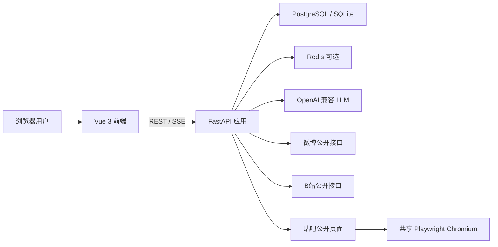
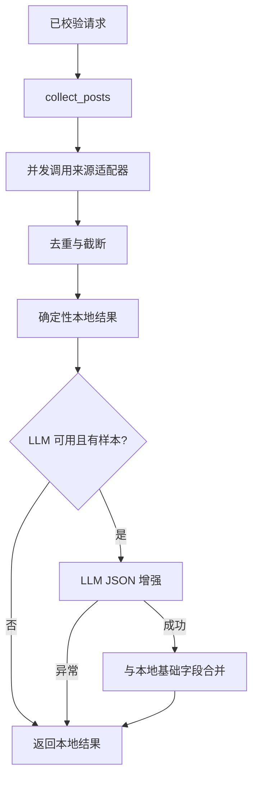
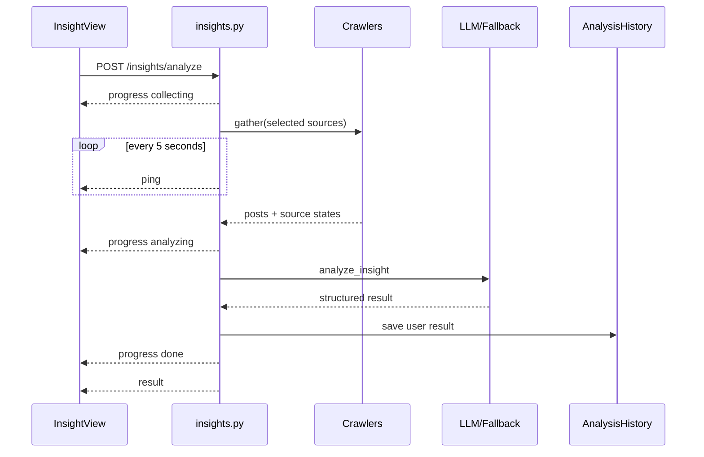
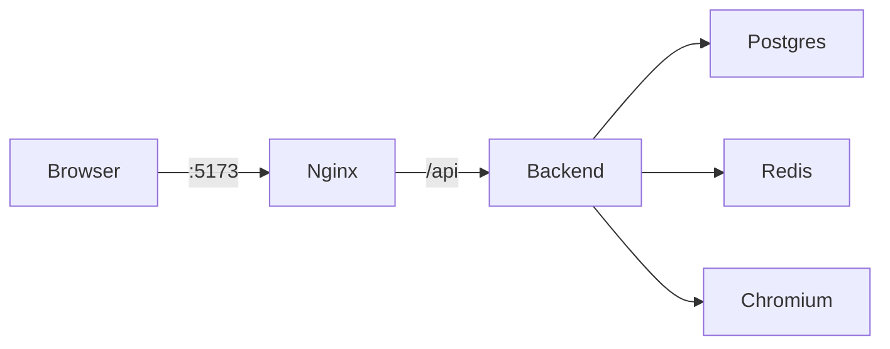

# InfoPulse 架构说明书

> 版本：v4.0
> 更新日期：2026-07-20
> 对应实现：Vue 3 + FastAPI + PostgreSQL/SQLite + Redis + Playwright

## 1. 架构目标

InfoPulse 的架构围绕四个原则设计：

1. **结果优先**：用户看到观点、来源和结论，不看到爬虫日志。
2. **单源失败可降级**：微博、B站或贴吧任一失败都不能拖垮整个工作流。
3. **模型可替换**：业务不依赖某一家 LLM，未配置模型也能完成基本流程。
4. **数据可追溯**：结论保留来源状态、代表链接、样本量和事实风险。

## 2. 系统上下文



前端不直接访问第三方平台。Cookie、请求频率和来源失败都由后端统一处理。

## 3. 目录结构

```text
InfoPulse/
├── README.md
├── docker-compose.yml
├── 需求.md
├── 架构说明书.md
├── 开发步骤.md
├── backend/
│   ├── .env.example
│   ├── .dockerignore
│   ├── Dockerfile
│   ├── Dockerfile.render
│   ├── requirements.txt
│   ├── app/
│   │   ├── main.py
│   │   ├── config.py
│   │   ├── api/
│   │   │   ├── auth.py
│   │   │   ├── insights.py
│   │   │   ├── mouthpiece.py
│   │   │   ├── timeline.py
│   │   │   ├── hot_search.py
│   │   │   └── history.py
│   │   ├── core/
│   │   │   ├── database.py
│   │   │   ├── redis.py
│   │   │   ├── security.py
│   │   │   └── llm.py
│   │   ├── models/
│   │   ├── schemas/
│   │   └── services/
│   │       ├── auth_service.py
│   │       ├── cleaner.py
│   │       ├── workflows.py
│   │       └── crawler/
│   │           ├── base.py
│   │           ├── weibo.py
│   │           ├── bilibili.py
│   │           ├── tieba.py
│   │           ├── browser_manager.py
│   │           └── stealth_patcher.py
│   └── tests/
└── frontend/
    ├── Dockerfile
    ├── nginx.conf
    ├── vite.config.ts
    └── src/
        ├── api/
        ├── assets/
        ├── components/
        ├── router/
        ├── stores/
        ├── utils/
        └── views/
            ├── AuthView.vue
            ├── HomeView.vue
            ├── insight/InsightView.vue
            ├── mouthpiece/MouthpieceView.vue
            ├── timeline/TimelineView.vue
            ├── HotSearchView.vue
            └── HistoryView.vue
```

## 4. 后端分层

### 4.1 API 层

API 层负责鉴权、请求校验、HTTP/SSE 协议和持久化边界，不实现具体采集或模型提示词。

| 文件 | 职责 |
| --- | --- |
| `api/auth.py` | 注册、登录、刷新、个人资料 |
| `api/insights.py` | 创建 SSE 队列、发送心跳、保存洞察历史 |
| `api/mouthpiece.py` | 调用表达创作工作流并保存结果 |
| `api/timeline.py` | 采集线索、构建时间线、保存结果 |
| `api/hot_search.py` | 返回缓存热榜并解释单条话题 |
| `api/history.py` | 跨模块历史查询和用户级删除 |

### 4.2 Schema 层

`schemas/workflows.py` 是所有工作流的输入边界：

- 平台只能是 `weibo`、`bilibili`、`tieba`。
- 平台列表至少一个并自动去重。
- 关键词、文案、样本量和情绪强度都有上限。
- 热榜解释使用 `HotItemRequest`，不接受任意超大字典。
- Refresh Token 使用独立请求模型，不能把 Access Token 当刷新凭证。

### 4.3 Service 层

`services/workflows.py` 组合采集、清洗、本地分析和 LLM：



本地结果先生成，保证模型失败时字段结构不变。LLM 只能增强概览、观点和表达，不能决定鉴权、来源状态或历史归属。

## 5. 数据采集架构

### 5.1 统一接口

`crawler/base.py` 定义：

- `RawPost`：帖子 ID、标题、正文、作者、发布时间、URL、平台。
- `RawComment`：评论 ID、帖子 ID、正文、作者、点赞和时间。
- `BaseCrawler.search()`：按关键词返回公开帖子。
- `BaseCrawler.get_comments()`：按帖子返回公开评论。
- `BaseCrawler.is_available()`：运行环境能力检查。

`crawler/__init__.py` 是唯一默认注册表，只注册三个产品来源。未注册适配器即使文件存在，也不会出现在 API 或前端中。

### 5.2 来源策略

| 来源 | 客户端 | 超时 | 特点 |
| --- | --- | --- | --- |
| 微博 | 复用 `httpx.AsyncClient` | 工作流 22 秒 | Cookie 可选；限流时可能返回空或 HTML |
| B站 | 复用 `httpx.AsyncClient` | 工作流 22 秒 | 搜索和评论公开接口，无需登录 |
| 贴吧 | 共享 Playwright | 工作流 45 秒 | SPA 页面，需要渲染和可选 Cookie |

### 5.3 浏览器管理器

`BrowserManager` 是进程内单例，解决 Chromium 的资源和并发问题：

- `_launch_lock` 防止并发首次请求重复启动浏览器。
- `_task_lock` 保证同一时刻只有一个重型贴吧任务。
- `get_page()` 获取任务锁并创建页面。
- 贴吧适配器在 `finally` 中关闭页面并调用 `mark_task_done()` 释放锁。
- 每 20 个任务重启一次浏览器。
- 内存统计包含 Python 进程和全部 Chromium 子进程。
- 重启只清理当前后端创建的 Chrome/Chromium 子进程，不扫描系统全局进程。

`BROWSER_RESTART_MB` 默认 800，可根据 Docker Desktop 或 Linux 环境调整。

## 6. 核心工作流

### 6.1 热点洞察 SSE



事件格式：

```text
event: progress
data: {"stage":"collecting","message":"正在汇集公开讨论","percent":12}
```

SSE 内部异常只写服务端日志，客户端收到统一错误文案，避免泄露堆栈或第三方响应。

### 6.2 热搜解读

- `fetch_hot_rankings()` 使用进程内缓存，TTL 300 秒。
- B站公开热榜请求超时 5 秒。
- 请求失败时返回本地示例条目，页面始终有结构可展示。
- 前端先渲染榜单，再异步请求首条解释，不让模型调用阻塞整页。

## 7. LLM 适配与降级

`core/llm.py` 封装 OpenAI 兼容客户端。配置来自：

```env
LLM_API_KEY=
LLM_API_BASE=https://api.openai.com/v1
LLM_MODEL=gpt-4o-mini
```

三个业务降级函数：

- `fallback_insight()`：词典情绪、平台计数、代表观点和风险提示。
- `generate_mouthpiece()` 本地结果：保留原文、生成基础标题和三个版本。
- `build_timeline()` 本地结果：按公开样本时间字段生成节点，缺失时间明确标记。

这套策略使开发、演示和测试不依赖付费 API。

## 8. 认证与会话

### 8.1 后端

- 密码由 bcrypt 哈希，哈希和验证进入线程池，不阻塞 FastAPI 事件循环。
- Access Token 默认 30 分钟。
- Refresh Token 默认 7 天，并带 `type=refresh` 声明。
- 刷新接口验证 Token 类型、用户存在和账号状态，然后轮换双 Token。

### 8.2 前端

- Pinia 保存当前用户和 Token。
- Token 持久化到 `sessionStorage`，作用域为当前标签页。
- Axios 自动附加 Bearer Token。
- 401 触发一次共享刷新 Promise；并发请求等待同一个刷新结果。
- 刷新失败时清理会话并跳转 `/auth`。

## 9. 数据模型

### 9.1 `users`

保存账号、密码哈希、头像、状态和创建时间。用户与历史记录是一对多关系。

### 9.2 `analysis_histories`

| 字段 | 说明 |
| --- | --- |
| `id` | UUID 字符串 |
| `user_id` | 记录所有者 |
| `module` | `insight`、`mouthpiece`、`timeline` |
| `input_params` | JSON 输入快照 |
| `output_result` | JSON 输出快照 |
| `status` | 任务状态 |
| `error_message` | 可选内部错误信息 |
| `created_at` | 创建时间 |

开发环境通过 `Base.metadata.create_all()` 建表。正式生产升级应引入 Alembic 迁移，不依赖自动建表修改已有结构。

## 10. 前端架构

### 10.1 共享层

- `api/request.ts`：Axios、鉴权头、统一错误和刷新重试。
- `api/workflows.ts`：四个工作流和统一历史的类型化调用。
- `utils/sse.ts`：解析多行 SSE、心跳、JSON 错误和 70 秒总超时。
- `stores/user.ts`：会话与刷新并发控制。
- `components/layout`：共享导航、页脚和页面容器。

### 10.2 页面视觉语言

五个核心界面不复制同一套卡片模板：

| 页面 | 视觉语言 | 用户心理 |
| --- | --- | --- |
| 首页 | 新闻编辑台、主稿图片、讨论榜 | “今天先看什么” |
| 热点洞察 | 调查桌、深色来源轨、报告板 | “把这个话题查清楚” |
| 表达工作室 | 暖色写作室、纸张预览 | “把我的话写得更有分寸” |
| 事件脉络 | 档案室、案卷与时间节点 | “把碎片排成事件” |
| 热搜解读 | 深色信号监控台、雷达动效 | “哪里正在升温” |
| 内容档案 | 纸质情报目录、编号记录 | “找回过去生成的内容” |

登录页使用新闻编辑场景图片和清晰表单，不采用与业务页相同的仪表盘布局。

## 11. 部署架构

### 11.1 本地开发

- Vite：`127.0.0.1:5173`
- FastAPI：`127.0.0.1:8000`
- Vite 将 `/api` 代理到后端。
- 可用 SQLite 代替 PostgreSQL，Redis 失败不影响启动。

### 11.2 Docker Compose



- 前端采用 Node 构建阶段和 Nginx 运行阶段。
- Nginx 对 `/api` 反向代理，关闭 SSE 缓冲并设置 90 秒读取超时。
- 后端容器共享内存 1GB、内存上限 2GB。
- `.dockerignore` 排除 `.env`、数据库、日志和缓存，防止密钥进入镜像层。

## 12. 可靠性与安全边界

- 所有业务路由依赖 `get_current_user`。
- 统一历史按 `user_id` 过滤读取和删除。
- 第三方失败以来源状态返回，不伪装成功。
- Cookie 只通过环境变量读取，不进入返回模型。
- 不记录完整请求头、Cookie 或 API Key。
- 热榜和 LLM 输入有字段长度限制。
- 浏览器任务串行，页面必关，进程清理限定父子关系。
- 生产环境必须替换默认 JWT Secret、启用 HTTPS，并限制 CORS 域名。

## 13. 已知限制

- 社交平台接口和页面结构可能随时变化，公开数据源不能承诺 100% 可用。
- 微博无 Cookie 时容易空结果或限流。
- 贴吧使用浏览器，资源消耗高于 httpx 来源。
- 当前热榜来自微博公开热搜接口，尚未聚合 B站和贴吧官方榜单。
- 内容档案目前提供摘要和继续创作入口，尚无独立详情与导出页面。
